# Mi Portafolio
##Entra y da un vistazo!

#Research 📋
* **Plantear el contexto:**
    >¿Quiénes serán los *usuarios*?
    >¿Cuáles serán sus *objetivos/necesidades*?
    >¿Cómo los *resuelve* mi portafolio?

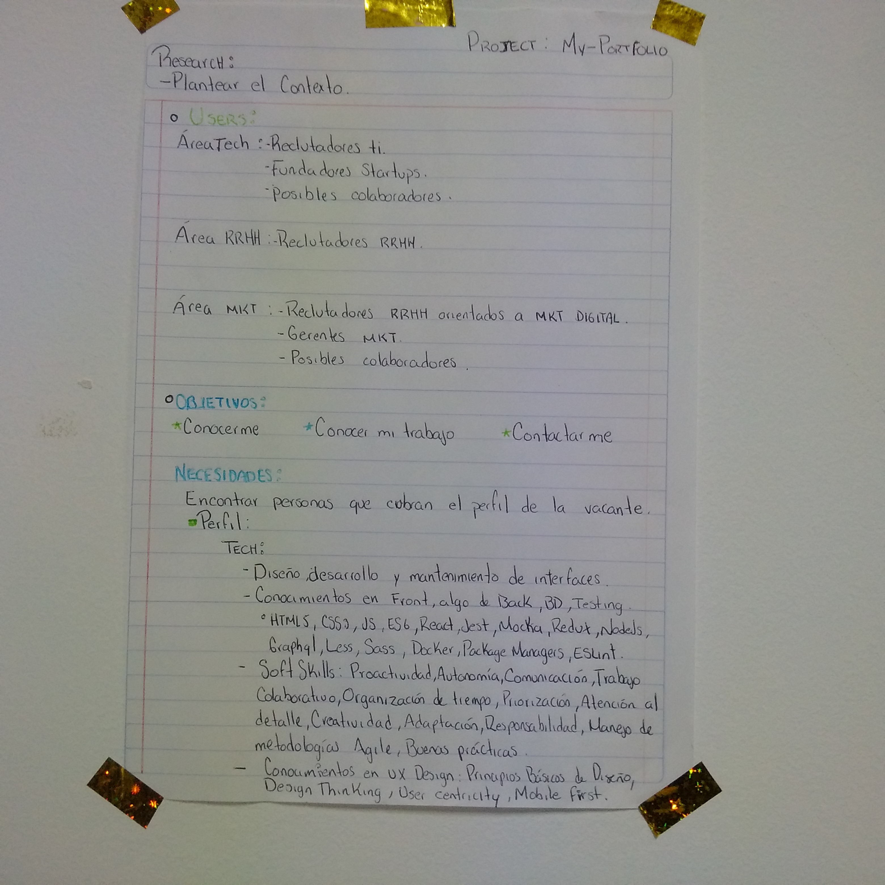

#Benchmarking 🚀
* **Investigué las tendencias de diseño web para 2019-2020.**

####Box Model:
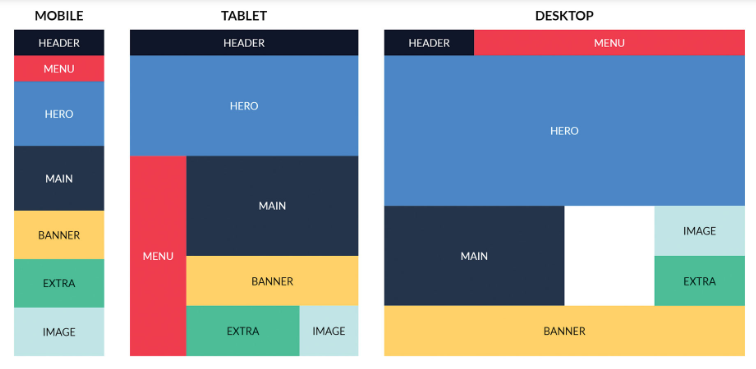
####Tipografías con potencia y cuerpo:
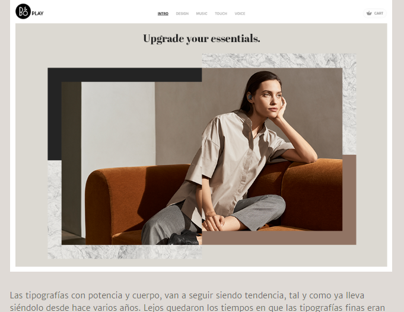
####Uniformidad y Minimalismo:
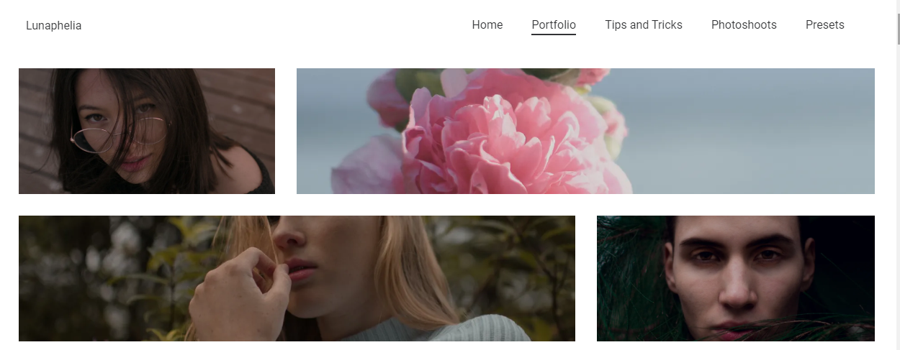
####Gigantismo:
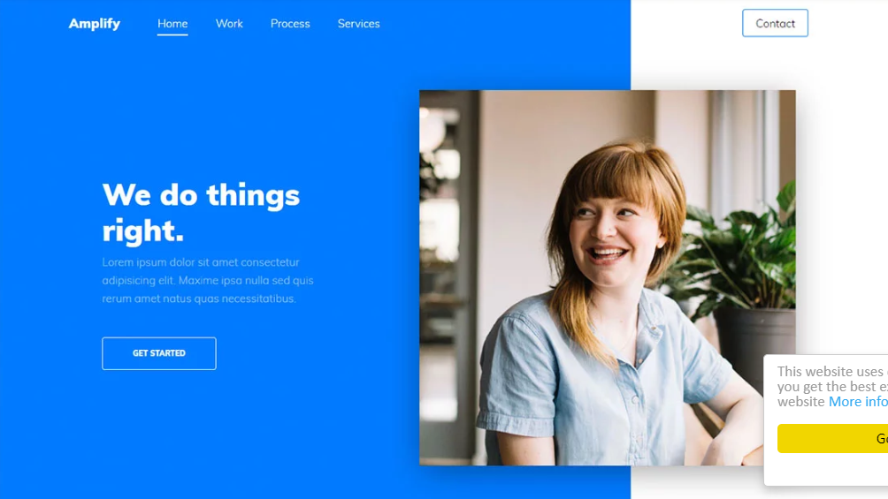
####Duotonos y Degradados:
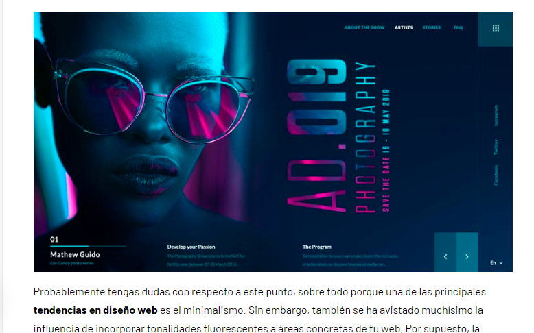
####Formas orgánicas:
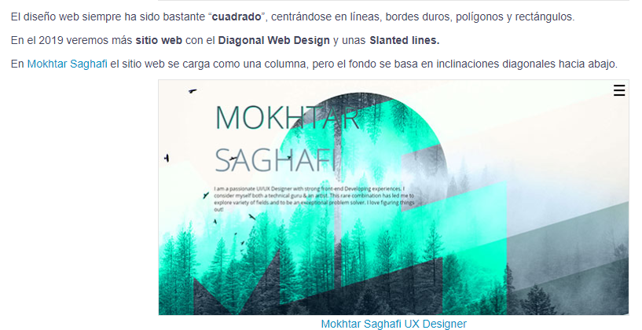
####Animaciones y vistas *Before-After:*
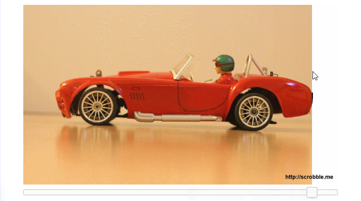
####GIF's y Cinemagraph's

* **Busqué portafolios en la web, que pudieran servirme de inspiración.**
   * https://www.bolajiayodeji.com/about/
   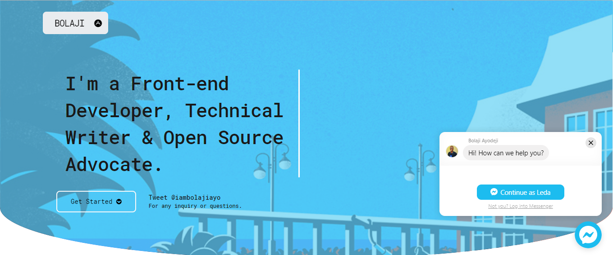
   * https://marc.dev/
   
   * http://webwabisabi.com/
   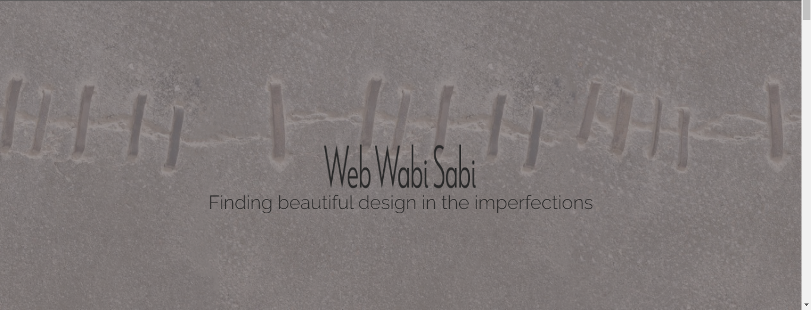
   * https://kyleshook.com/
   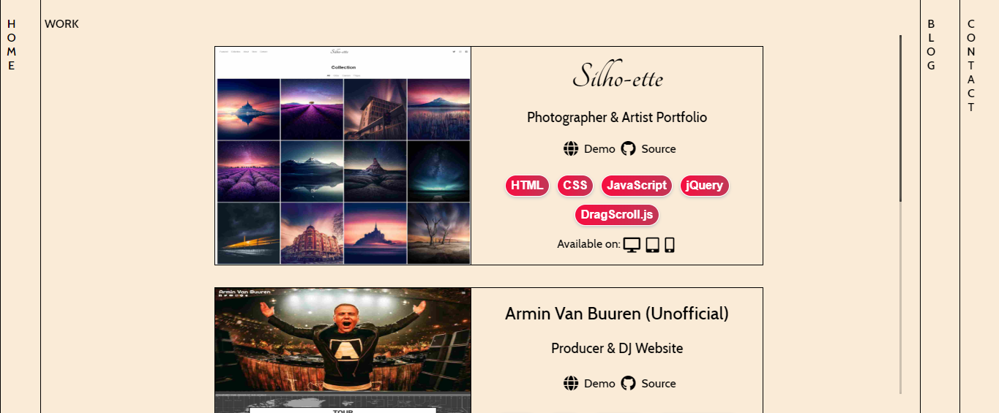
   * https://elimchan.com
   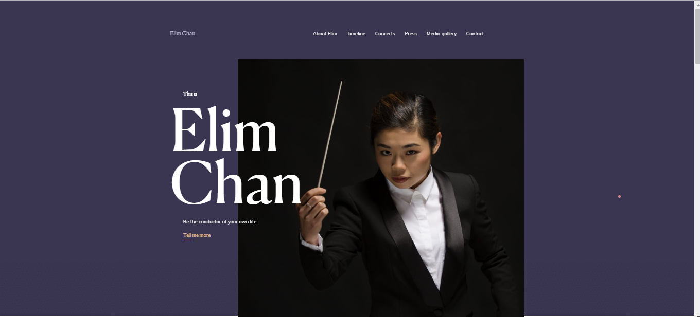

* **Comparé las similitudes entre los portafolios y las tendencias actuales.**

* **Definir cuál es el estilo que quiero proyectar.**

#Insights 📢

#About me

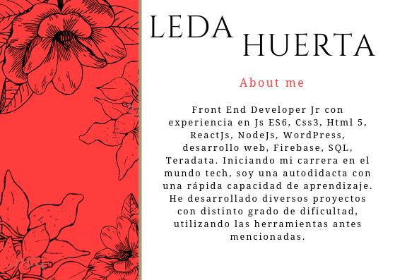

#proto
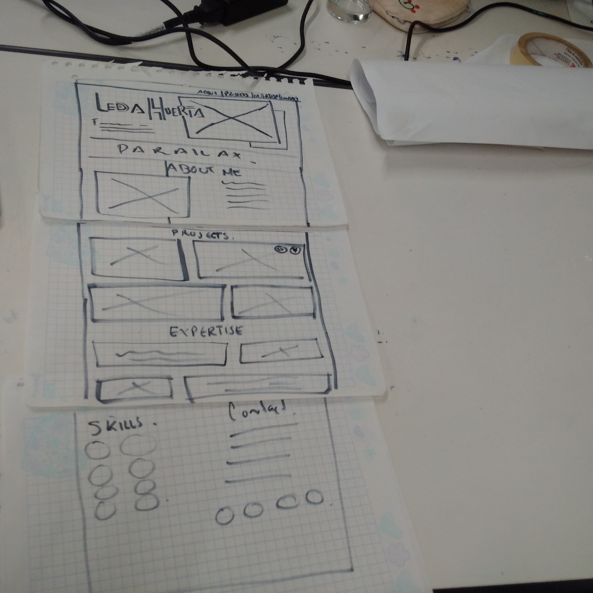
